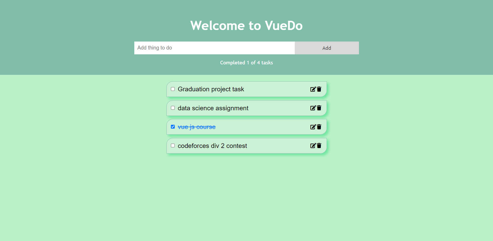

📝 Table of Contents
- [📙 About](#about)
- [🏁 Install](#install)
- [💻 Built using](#tech)
- [📂 Folder Structure](#folderstructure)
- [📷 Demo Screenshots](#screenshots)

# 📙 About <a name = "about"></a>
Vue Do is a sample to do list using Vue.js and Vuex for state management.

# 🏁 Get started <a name = "install"></a>
```
git clone https://github.com/gaserashraf/Vue-Do.git
```
```
cd Vue-Do
```
```
npm install
```
```
npm run serve
```

# 💻 Built using <a name = "tech"></a>
- **Vue js**
- **Vuex**


# 📂 Folder Structure <a name = "folderstructure"></a>
```
|-- src,
|   |-- App.vue,
|   |-- main.js,
|   |-- README.md,
|   |-- assets,
|   |   |-- logo.png,
|   |   |-- README.md,
|   |-- components,
|   |   |-- README.md,
|   |   |-- body,
|   |   |   |-- README.md,
|   |   |   |-- ToDoItem.vue,
|   |   |   |-- ToDoItems.vue,
|   |   |-- header,
|   |       |-- README.md,
|   |       |-- ToDoHeader.vue,
|   |       |-- ToDoInput.vue,
|   |-- store,
|       |-- README.md,
|       |-- todoStore.js
```
# 📷 Demo Screenshots
<div name="screenshots" >
    
</div>
